# 2025's Top 11 Best Video Messaging Tools

Ever sent an email and wondered if anyone actually read it? Or worse, watched your carefully crafted message get lost in an inbox tsunami? Text emails feel cold, impersonal, and frankly boring in a world where everyone's drowning in messages. Video messaging flips that script entirely—suddenly you're having face-to-face conversations without the scheduling nightmare of Zoom calls. Sales teams close deals faster, support teams explain complex issues clearly, and marketing folks create connections that typed words simply can't match. The challenge is finding platforms that make recording, sending, and tracking videos actually easy instead of adding another headache to your workflow. This guide walks through proven video messaging software that turns digital communication into genuine human connection, helping you stand out, get responses, and build relationships that matter.

***

## **[BombBomb](https://bombbomb.com)**

Enterprise-grade video engagement platform that boosts email response rates by 120 percent.

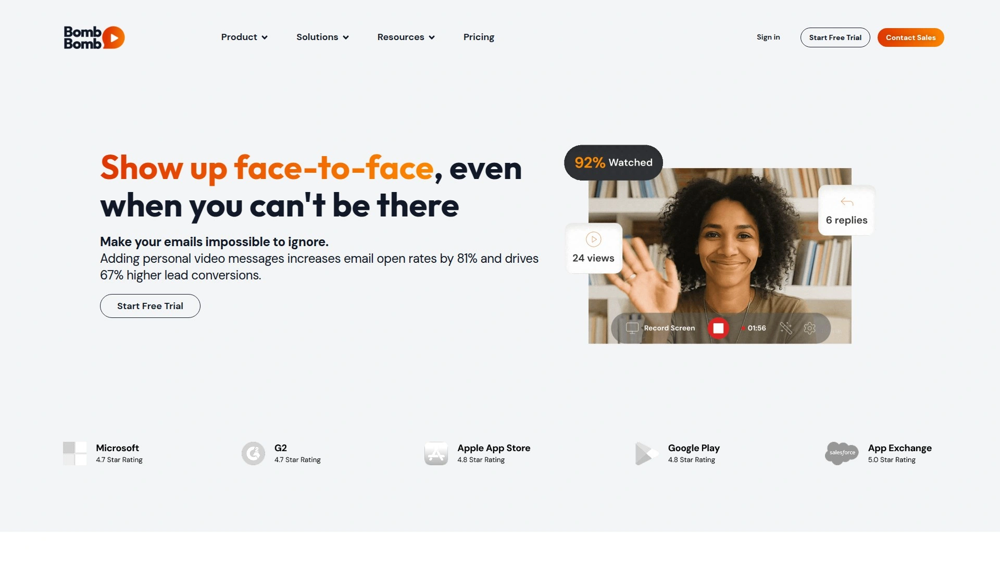

BombBomb pioneered the async video messaging space and continues leading with tools designed for teams that need to cut through digital noise. The platform increases email opens by 81 percent and generates 67 percent more lead conversions compared to text-only messages, according to company data. Video messaging reduces required touchpoints by 70 percent, meaning deals close faster with less back-and-forth.

**Built for Teams That Scale**

The Engage platform offers unlimited video messages, unlimited recording length, and unlimited storage across all plans—no artificial caps that force deletions or upgrades. Record face-to-face videos, screen captures, or both simultaneously using browser extensions for Chrome and Edge or mobile apps for on-the-go recording. Trim, stitch, and polish videos in seconds without any video editing training required.

Team workspaces provide centralized video management with folders, subfolders, labels, and permission controls. Admins can govern content, assign tasks, and maintain brand consistency across departments. Custom video player pages match company branding at both organization and team levels. The platform embeds directly into CRMs like Salesforce and integrates with over 65 applications including Outreach, Gmail, and Outlook, letting teams work where they already spend their days.

**Enterprise Security and Analytics**

SOC 2 Type II compliance, single sign-on, and role-based access control meet enterprise security standards. Track views, engagement metrics, and team performance through unified dashboards. Automated outreach campaigns use smart assignments and fallback logic to maintain consistent communication. Real-time notifications alert you when prospects watch videos, enabling timely follow-ups when interest peaks. Branded video pages include customizable calls-to-action that drive specific next steps, transforming passive viewing into active engagement.

***

## **[Vidyard](https://www.vidyard.com)**

AI-powered video platform serving over 100,000 teams with personalized messaging at scale.

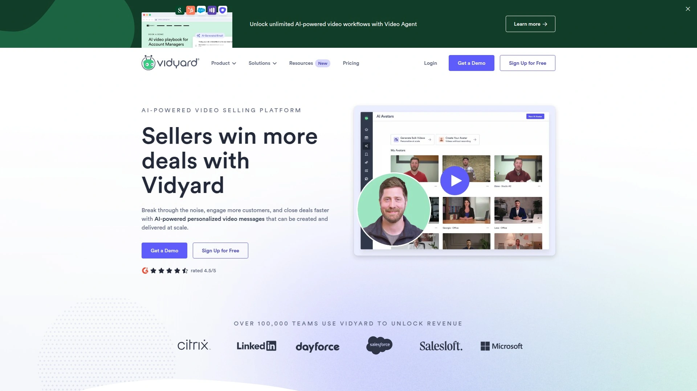

Vidyard positions itself as the platform where sellers win more deals through personalized video messages that break through busy inboxes. The company's AI Avatar technology automatically engages buyers with contextually relevant messages at optimal times, automating tedious sales workflows so reps focus on high-value conversations. Every rep becomes a top performer by easily replicating messages that resonate with customers.

The platform records screen, webcam, or split-screen combinations directly from browser extensions. Videos generate animated preview thumbnails when embedded in emails, significantly increasing click-through rates versus plain text links. Detailed analytics track exactly who watches videos, which sections they view, and for how long. Sales representatives receive real-time notifications when prospects engage, providing critical signals of interest and buying intent.

Vidyard serves as a secure, ad-free hosting platform for all business video content, eliminating the distractions and competitor advertisements found on public platforms like YouTube. The enterprise video platform includes flexible team controls, accessible content management, and dedicated support. Integration flows keep video view data and automation processes moving through existing tools and channels—from email and social to CRM and sales enablement systems. Video engagement analytics trigger automated workflows, creating seamless experiences that drive pipeline and accelerate deal cycles.

***

## **[Loom](https://www.loom.com)**

Free screen recorder enabling asynchronous communication for distributed teams worldwide.

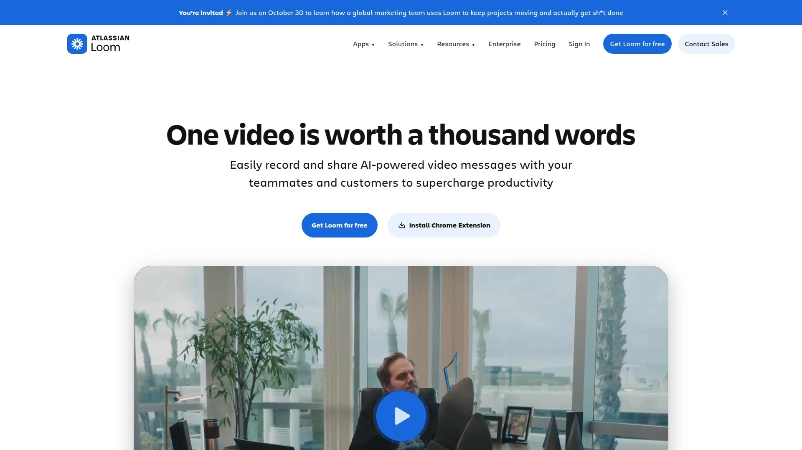

Loom revolutionized remote work by making asynchronous video communication accessible to everyone. The platform allows recording screen and face simultaneously, making communication far more personal than written messages while maintaining the flexibility of async work. This approach solves the disconnection that creeps into remote teams when tone gets misread or messages get misunderstood in text-only communication.

Recording both screen and webcam creates genuine face-to-face feelings even when explaining complex processes, sharing presentations, or walking someone through detailed topics. The personal connection reduces misunderstandings caused by tone, messaging, or language barriers. Loom's AI-powered features enhance videos without requiring technical skills or video production knowledge.

The platform integrates into daily workflows for teams, educators, and creators who need clearer communication without constant meetings. Videos share via simple links that recipients watch on their own schedule, respecting different time zones and work styles. This flexibility became essential as companies shifted to distributed workforces, allowing teams to stay connected without living in synchronous meetings. Loom's community features provide templates and best practices for effective async communication, helping teams maximize the medium's potential.

***

## **[Dubb](https://dubb.com)**

AI-powered video sales system with built-in CRM capabilities and native email marketing tools.

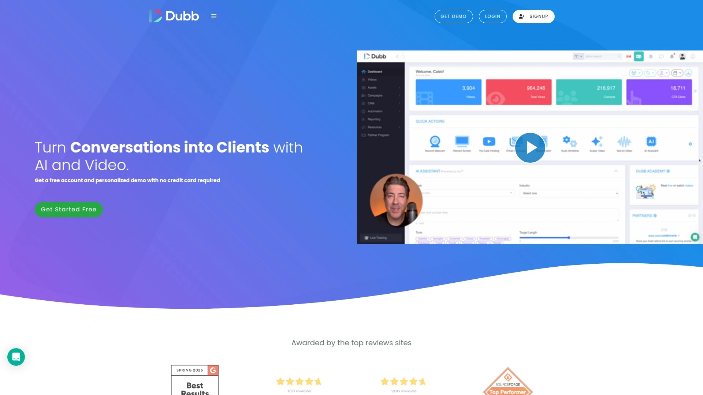

Dubb combines comprehensive video communication with customer relationship management, creating an all-in-one system for video-first businesses. The platform matches BombBomb's core functionality then extends beyond with advanced tracking options for email opens, video watches, and CTA clicks. Multiple calls-to-action per video—calendar links, file downloads, forms—drive specific next steps within the viewing experience.

**Email Integration Done Right**

Native integration with Gmail, Outlook, and email marketing tools allows recording or uploading videos directly from your inbox. Personalize messages with custom text, choose from saved video libraries, and embed content without file attachment headaches. Unlike competitors that charge extra for email template access, Dubb includes free templates with all plans.

The embedding process works seamlessly across Gmail, Microsoft Outlook, Mac Mail, Yahoo Mail, and automation systems like MailChimp, Constant Contact, and HubSpot. Never attach video files directly—the platform handles heavy video files on its servers, ensuring messages deliver regardless of file size. The Chrome Extension makes webcam recording incredibly simple: click the Dubb icon, hit record, and customize with recipient details before sending.

Deep analytics provide transparency rare in the space, with downloadable insights into communication effectiveness. The focus on both creation and distribution makes Dubb appealing for teams wanting comprehensive video sales infrastructure without juggling multiple platforms.

***

## **[Sendspark](https://www.sendspark.com)**

Number one video messaging platform for sales communication with AI-powered personalization.

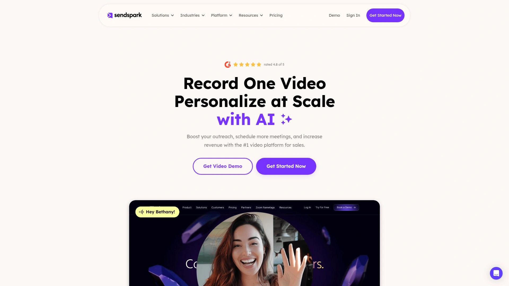

Sendspark specializes in creating personalized videos at scale using artificial intelligence. Record one video, then automatically generate thousands of personalized versions for different prospects with their first names, company details, and other variables dynamically inserted. Dynamic Background technology overlays your speaking video over prospects' websites or LinkedIn profiles, creating highly relevant context.

The platform addresses three core sales scenarios: warming up cold emails with personality-driven videos, showing platform value in ways words can't capture, and sending meaningful follow-ups after meetings or silent periods to keep relationships alive. Record directly from webcam, upload pre-existing videos, or request videos from customers, colleagues, or influencers through simple Video Request links.

**Integration and Deployment**

Dozens of integrations connect Sendspark to HubSpot, HighLevel, Instantly, Salesforce, Marketo, Outreach, Mailchimp, and other marketing tools. Videos embed in nearly any email campaign or sales sequence, generating up to four times more engagement. Detailed analytics show who watched, how much they viewed, and engagement levels—letting you measure ROI, optimize messaging, and refine strategy based on actual data.

Custom branding options, detailed analytics, customizable calls-to-action, light editing capabilities, and the ability to record custom intros in front of pre-existing videos provide flexibility without complexity. The agency-focused features allow creating videos for clients at scale, making Sendspark valuable for service providers managing outreach across multiple brands.

***

## **[Hippo Video](https://www.hippovideo.io)**

Agentic AI video platform creating personalized sales and marketing videos in 170 plus languages.

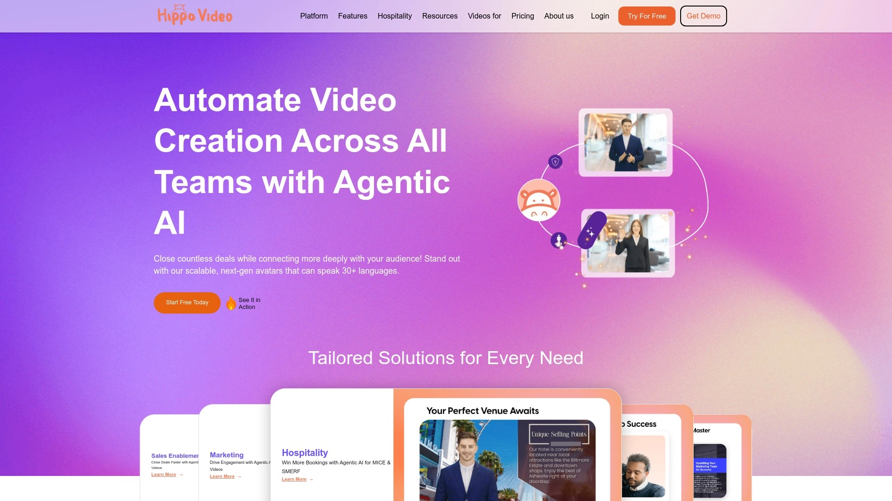

Hippo Video earned recognition as a Leader in the Video Email Category and High Performer in multiple quarters through G2 reviews. The platform lets teams create, edit, share, and track videos while recording screen, webcam, or both to review documents, deliver presentations, or educate prospects and clients. Videos appear directly in compose sections—no downloads, no attachments required. Recipients simply click to start playing.

**Engagement Tracking That Matters**

Track engagement for one email or many simultaneously, spending more time on genuinely interested prospects based on actual behavior instead of guesswork. Real-time notifications reveal who watched videos, for how long, click rates, and email open rates, enabling instant follow-ups when interest peaks. Research shows 77 percent of people reported boosts from video email compared to traditional typed text, with 20 percent more than doubling their results.

Compared to text emails, Hippo Video excels at increasing email open rates, generating clicks through messages, converting leads, staying in touch meaningfully, and generating referrals. The platform integrates with LinkedIn, Salesforce, HubSpot, Zoom, Slack, and other popular sales and marketing tools, eliminating app-juggling. AI Avatar technology creates videos from text in 30-plus languages with instant script generation, making video creation accessible regardless of camera comfort levels.

***

## **[Covideo](https://www.covideo.com)**

Video messaging platform specializing in dealership and automotive industry communication.

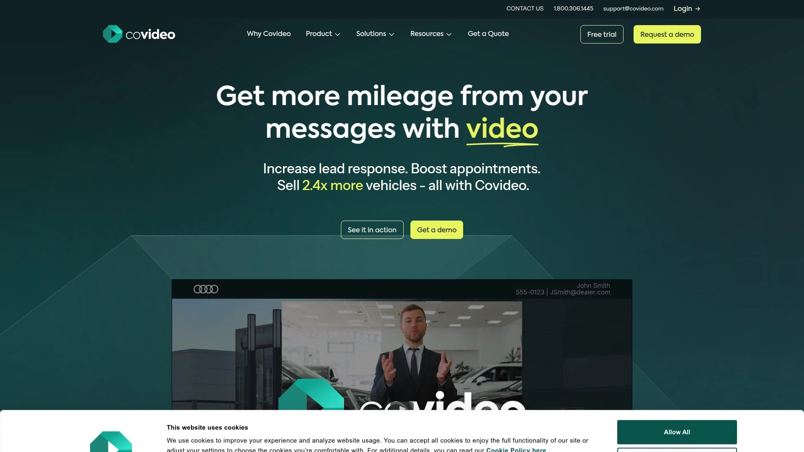

Covideo serves businesses needing engaging, personalized video content distributed across multiple communication channels. The screen and webcam recorder creates video email content using smartphones or webcams, with options to upload existing marketing assets and merge them into customized messages. Trim and merge clips, add customizable call-to-action buttons, and create personalized video content at scale without extensive editing knowledge.

Create video libraries for frequently used content, eliminating repetitive searches for the same clips. Send videos as many times as needed without re-recording. The customizable video player matches your branding with chosen colors and designs. Ready-to-use landing page designs create seamless viewing experiences that reinforce brand identity. Share personalized videos on social media, send to leads via email, or distribute through CRM systems.

Real-time notifications alert you when recipients view videos, providing perfect follow-up timing. The Outlook and Gmail integrations plus Google Chrome extension make recording and sending simple from existing workflows. Video reply capabilities enable two-way video conversations, transforming static email exchanges into dynamic dialogues. The dealership focus means features cater specifically to automotive sales processes, customer follow-ups, and service department communication.

***

## **[Soapbox by Wistia](https://wistia.com/product/video-recording)**

Free video recording tool with professional features for business communication.

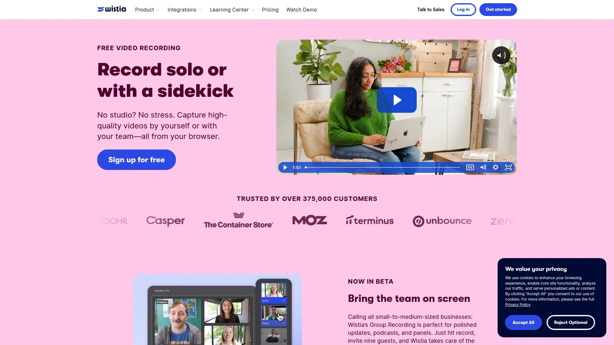

Wistia's Soapbox offering provides free video recording capabilities for solo or collaborative projects, capturing high-quality videos from browsers without studio equipment. Record yourself, your screen, or both simultaneously using the Chrome extension. Transition seamlessly between webcam, screencast, and split-screen views depending on what you're explaining. Unique thumbnails and customizable player colors maintain brand consistency.

**Tiered Feature Sets**

The free plan includes unlimited Soapbox videos, all standard transition features, end-of-video links, and export capabilities to your Wistia account. The Pro tier at 300 dollars annually adds downloadable shareable videos, analytics to track performance, customizable video pages, and meeting booking functionality directly from videos. Advanced tier pricing varies based on needs, adding default team branding, comprehensive visitor view and engagement tracking, and multi-user access to single videos.

Embedding Soapbox videos in email requires exporting to your Wistia account, then copying thumbnail links or URLs from the Share section. Email clients with rich text editors—Gmail, Outlook, Yahoo—support thumbnail and link combinations. The Gmail integration checkbox in your Integrations page enables direct video sharing from the Soapbox interface. The professional polish and Wistia's video marketing platform backing make Soapbox appealing for marketers wanting branded, trackable videos without complex production workflows.

***

## **[Potion](https://www.sendpotion.com)**

Unlimited custom and personalized AI video generator cloning face, voice, and gestures.

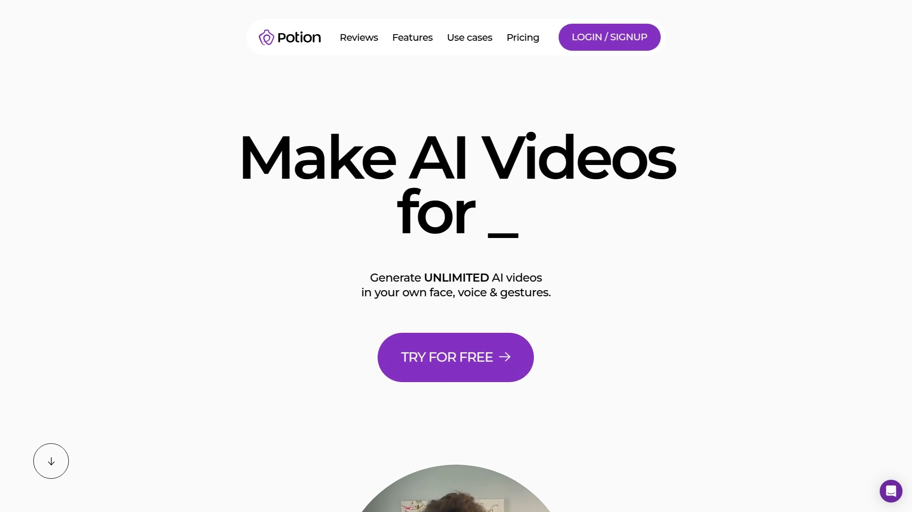

Potion takes video personalization to extreme levels by cloning your face, voice, and gestures to generate unlimited AI videos in your personality. Never worry about retakes or reshoots—the AI learns how you speak, emote, and gesture, then creates videos on your behalf. This technology reduces effort in video creation while enhancing engagement on sales and marketing campaigns through hyper-realistic personalization.

**Advanced AI Features**

Clone facial expressions and gestures to add realism to personalized videos with zero extra effort. Auto-generate screen recordings with personalized backgrounds showing prospect-specific content. Custom branded video pages and video player themes incorporate your domain and branding. Add stickers, emojis, GIFs, and images to customize AI videos. The platform maintains SOC 2 Type I compliance for security and safety.

The Starter plan provides 750 dynamic AI videos monthly with three full AI video templates, including face cloning, voice cloning, gesture cloning, and video personalization across multiple languages. Professional tier offers unlimited AI videos monthly with team features like Zapier webhooks, multi-user workspaces, roles and permissions, and custom domains. Enterprise adds whitelabel capabilities, AI video strategy consultations, on-demand team coaching, and highest priority support. Scale video production without individually recording each piece, making massive personalized outreach campaigns feasible for small teams.

***

## **[Bonjoro](https://www.bonjoro.com)**

Mobile-first video engagement platform converting three times more leads with personal videos.

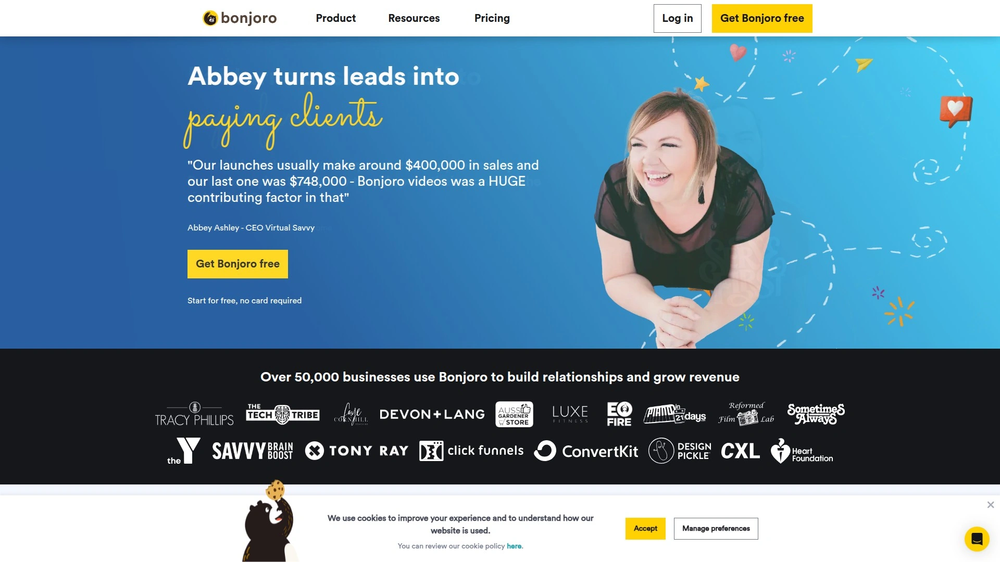

Bonjoro built its reputation on mobile video messaging that delights customers and drives conversions. Users report results like 16,200 dollars in extra sales within four weeks from video email campaigns. The platform focuses on converting leads, supporting customers, and building communities through personalized video at every customer journey stage. Record and send videos from desktop or mobile, create group videos for larger lists, and enjoy best-in-class delivery and open rates.

**Video Templates and CTAs**

Build custom video templates with your own branding to maintain consistency while saving time. Drive customer actions with calls-to-action and embedded apps directly in videos. Stand out from plain text emails with eye-catching, engaging video messages. The platform handles both fully personalized one-to-one videos and pre-recorded content when time gets tight. Group videos engage customers at scale while maintaining personal touches.

Connect Bonjoro to your CRM via the web app to automatically populate your task list with new signups, subscribers, or inquiries. Pull custom fields from your CRM to personalize each video on the fly with relevant prospect information. The video widget installs on your website to deliver personal welcomes, thank-yous, or support videos to customers in real-time while they're browsing. Integration with over a thousand tools through direct connections or Zapier makes video messaging part of daily processes without workflow disruption.

***

## **[Vidu](https://www.vidu.io)**

AI personalized video platform generating prospect-specific demos at scale for sales teams.

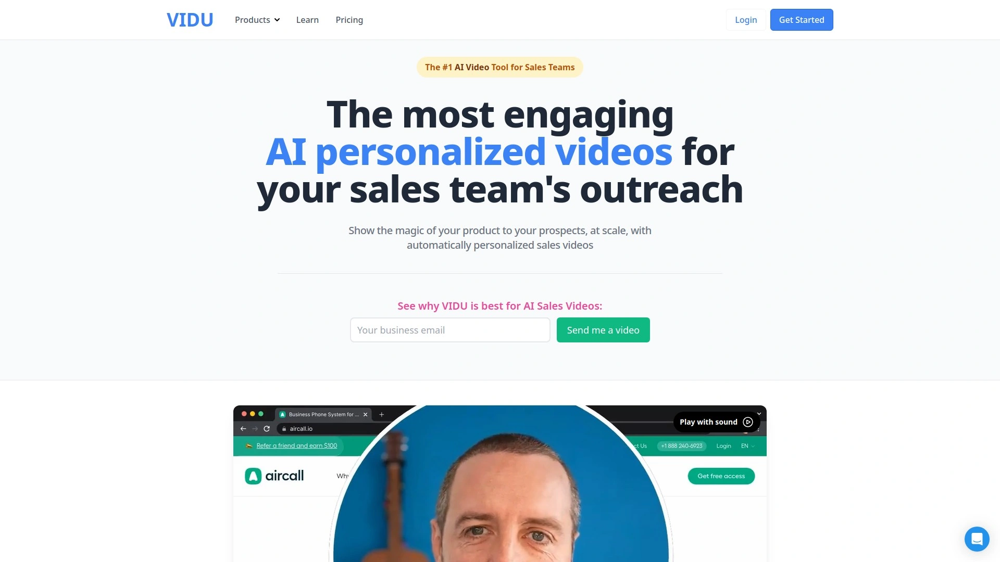

Vidu specializes in showing product magic to prospects at scale through automatically personalized sales videos. Record once, then generate countless personalized videos either just-in-time or in bulk using integrations, CSV uploads, or API connections. The platform easily generates personalized videos on prospects' websites or LinkedIn profiles, with options to build custom dynamic pages for specific use cases.

**Recording Made Simple**

Vidu's personalized video recorder makes creating stunning videos easy, with product animations and transitions baked into templates. Simply read the script one step at a time while recording. Share scripts with teams focused on different personas, industries, or use cases. Record once, then generate thousands of personalized videos for your prospects. What previously took two hours of video outreach turns into ten minutes of work.

Effortlessly generate videos while sipping morning coffee, then copy and paste them into email or LinkedIn. Sellers individually save hours weekly, making entire sales teams more effective. The content engine personalizes any video aspect including prospect and company names, logos, websites, brand colors, language, and use cases. Each seller can demonstrate product value in ways resonating with individual prospects. Users report booking five meetings in their first week using personalized video outreach through Vidu.

***

## FAQ

**How do video emails improve response rates compared to regular text emails?**

Video emails increase open rates by showing animated thumbnails or preview GIFs that immediately grab attention in crowded inboxes. Recipients see a human face before even clicking, creating instant connection and curiosity. Response rates improve because video conveys tone, personality, and emotion that text simply cannot, building trust faster and making your message memorable among dozens of generic text emails.

**Can I use video messaging platforms without technical skills or video production experience?**

Absolutely—modern video messaging platforms design interfaces specifically for non-technical users who need results fast. Most offer one-click recording from browser extensions or mobile apps, automatic editing features like trimming and merging, and simple sharing via links or direct email embedding. The entire process from recording to sending typically takes under three minutes, with no video editing knowledge required.

**Which video messaging platform works best for small sales teams versus large enterprises?**

Small sales teams benefit from platforms offering unlimited storage and straightforward pricing without per-seat minimums, focusing on ease of use and quick setup. Large enterprises need robust team controls, admin permissions, security compliance like SOC 2, CRM integrations, and centralized analytics across departments. Many platforms offer tiered plans scaling from individual users to enterprise deployments with features matching organizational complexity.

***

## Conclusion

Video messaging transforms digital communication from forgettable text into genuine human connection that drives results. Whether closing sales deals, supporting customers, or building community engagement, these platforms make creating and sharing personalized videos simple enough for daily use. **[BombBomb](https://bombbomb.com)** remains particularly suitable for organizations needing enterprise-grade security, unlimited video storage, and comprehensive team management features that scale from small groups to large departments. The platform's proven track record of boosting email opens by 81 percent and reducing required touchpoints by 70 percent demonstrates real-world impact on efficiency and conversion rates. Choose platforms matching your team size, technical requirements, and specific use cases—then watch response rates climb as your messages finally stand out in crowded digital channels.
